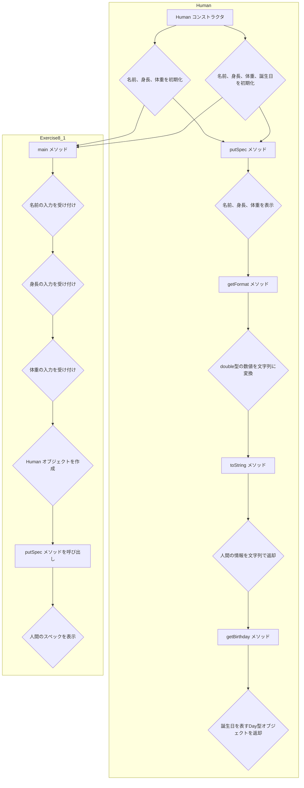

```mermaid

graph TD

    subgraph Human
        A[Human コンストラクタ] --> B{名前、身長、体重を初期化}
        A --> C{名前、身長、体重、誕生日を初期化}
        B --> D[putSpec メソッド]
        C --> D
        D --> E{名前、身長、体重を表示}
        E --> F[getFormat メソッド]
        F --> G{double型の数値を文字列に変換}
        G --> H[toString メソッド]
        H --> I{人間の情報を文字列で返却}
        I --> J[getBirthday メソッド]
        J --> K{誕生日を表すDay型オブジェクトを返却}
    end

    subgraph Exercise8_1
        L[main メソッド] --> M{名前の入力を受け付け}
        M --> N{身長の入力を受け付け}
        N --> O{体重の入力を受け付け}
        O --> P{Human オブジェクトを作成}
        P --> Q[putSpec メソッドを呼び出し]
        Q --> R{人間のスペックを表示}
    end

    B --> L
    C --> L

```